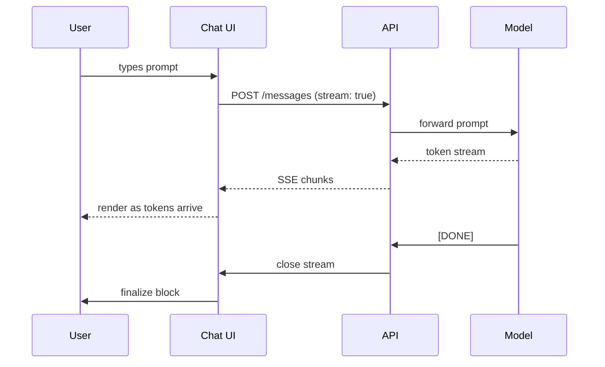
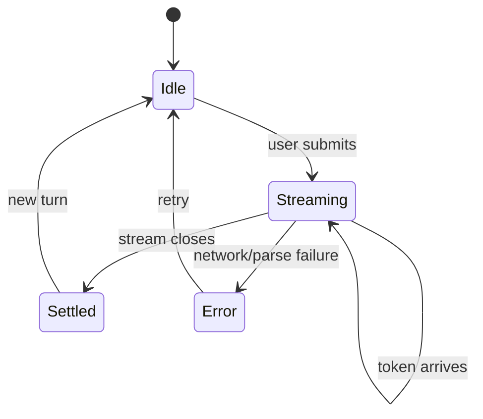

Sure — here's the round-trip for a typical chat completion, from keystroke to rendered response:



The UI renders each chunk the moment it arrives. Inkset measures the block once via pretext, then lays out with arithmetic, so the mid-stream reflow cost stays near zero.

And here's a rougher state view of what the UI is actually tracking per message:



Every ` ```mermaid ` fence gets promoted to a real SVG diagram. The mermaid library is dynamic-imported on the first diagram seen, so your base bundle stays lean if your app never emits one.
