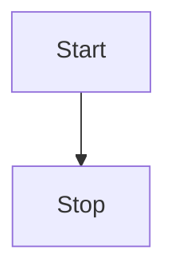

# Tl;dr: Inkset is rendering infrastructure for streaming AI output

Inkset is a JavaScript library that enables you to render LLM output in the browser. Under the hood, it is a layout pipeline that's powered by [pretext](https://github.com/chenglou/pretext) and optimized to stay stable while content is streaming in and long after it has settled. There is growing complexity in what LLMs are asking clients to render: generative UI components, math, code blocks, tables, and diagrams. Inkset is designed to handle all of these, along with obvious performance bottlenecks like long conversations and window resizing.

Inkset is the first engine of its kind that treats the problem of rendering this content as a layout problem instead of a parsing problem. The browser is not getting faster at layout and LLM responses are getting longer and more structurally varied. It's also a drop-in replacement to your existing rendering stack (`react-markdown`, `streamdown`, and others).

It's [open source](https://github.com/daviskeene/inkset) and you can install it with `npm install @inkset/core @inkset/react`. Keep reading to understand how it works and why you should use it in your next project.

## The thesis

Layout, not parsing, is the expensive operation in streaming AI UI.

The mental model goes like this. A browser computes layout globally. When a single paragraph grows by a word, the browser has to decide whether that word fits on the current line, and if it does not, everything below has to shift. That decision requires reading positions of elements already in the DOM, which forces the browser to stop whatever else it is doing and compute layout right now. This is called a forced synchronous reflow, and it is one of the most expensive things a browser can do. And it happens all the time when new tokens arrive in a streaming response.

Today, modern chat responses ask our browsers to do a lot of heavy lifting. Model providers and companies that power AI-native UIs are working on improving the situation, yet the landscape is changing so rapidly that currnet workarounds probably won't be enough.

### 1. The output is getting richer

A fast model emits fifty to two hundred tokens per second. Naively that is fifty to two hundred reflows per second. Most renderers debounce this, but debouncing makes text feel laggy and the underlying cost is still there. Rich content also add reach. Code blocks, math, tables, and diagrams each mount asynchronously. Every mount is a reflow trigger. A paragraph that settled ten tokens ago can be pushed down by a math block loading three tokens later.

### 2. Conversations are getting longer

There are still complaints about long-running AI conversations feeling slow/clunky. Every new message in a long thread triggers layout across the whole thread, because the browser does not know which blocks are semantically stable. Many of the big chat products will stutter on web after many, many turns. As model context window size increases, the average number of turns in a multi-turn conversation will also keep growing. In not-so-subtle ways, browsers are starting to lag behind frontier model capabilities.

### 3. Generative UI is becoming more common

There's another shift in terms of what users are asking models to serve as output. Generative UI is a relatively new phenomenon. Components that the model asks the client to render (json-render, A2UI, MCP Apps) each have their own mount timing / async data / internal state changes. Every one of those is a reflow trigger, and they are uncorrelated, so the browser cannot batch them.

### Inkset's place in all of this

"Render markdown, let CSS handle it" was built for documents that arrive whole and hold their shape. Streaming AI output does neither. Every workaround since (debouncing tokens, virtualizing long threads, lazily mounting rich blocks) patches a symptom of the same thing: the browser lays out globally, and streams are local. Inkset's bet is that the next rendering layer for AI will own layout instead of deferring to the browser. Measure once, re-layout with arithmetic, freeze what's settled. Inkset may not be the one that wins, but whatever does will look like this, and parsing will stop being the interesting problem.

## What you get

A chat UI that stays calm while the model is generating. Tokens land without shifting the paragraph above them. Math and code and diagrams appear and stay put. The column reflows on rotate or resize in arithmetic instead of a cascade. Long conversations feel the same at turn 1000 as they did at turn 10. You also get a suite of plugins that can display everything models like to produce.

```typescript
// Code blocks for syntax highlighting!
const fib = () => {
  if (n <= 1) return n;
  return fib(n - 1) + fib(n - 2);
};

fib(10); // 55
```

You can also render LaTeX math with KaTeX or Mathjax (whichever you need).

$$
\int_0^\infty \frac{x^2}{e^x} dx
$$

Tables too.

| Name        | Age (Years) |
| ----------- | ----------- |
| Inkset      | 0\*         |
| Davis Keene | 25          |

> \*just born!

And mermaid diagrams.



Inkset is [fully open source](https://github.com/daviskeene/inkset). You can install it with:

```bash
npm install @inkset/core @inkset/react
```

Drop `<Inkset />` into your chat UI or ask your favorite coding agent to set it up for you.

Use the controls above to switch themes, toggle plugins, and watch the stream demos. Read the [docs](/docs/introduction) for more information or [contact me](https://daviskeene.com) with any questions or ideas.
