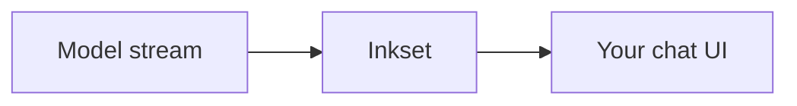

Inkset is an open source React library that renders streaming LLM output quickly, including Markdown, code, math, tables, diagrams, and generative UI components. It's built on [Pretext](https://github.com/chenglou/pretext) for efficient and responsive chat UIs, ships in a much smaller package than what you're probably using today, and is already running in production-grade software.

## Why Inkset

If you're building in {currentYear}, your web product probably displays AI output somewhere. When that response from an LLM streams in, or is rendered after a single completion, your browser does a lot of work to decide where each new token goes. With most renderers, every update or resize makes the browser recalculate the page's layout, an expensive operation called a "reflow". This cost grows with long-running chat histories and generative UI (like `json-render`), and presents itself as jittery text/laggy behavior. This can make your product _feel_ broken, even when the model behind it is good. To fix this, Inkset uses Pretext, a new tool that can measure where text is supposed to go based almost entirely on what computers are already really good at: arithmetic.

The result is a lightweight, drop-in replacement for your current rendering stack that is built with performance in mind. To switch, point your coding agent at [inkset.dev/skill.md](https://inkset.dev/skill.md), and it handles the setup. It's also great at handling inline math & code snippets. Inkset primarily exists to ensure that a model's intelligence can be properly expressed on the web.

## What it renders

Code blocks come with syntax highlighting:

```typescript
const fib = (n: number): number => {
  if (n <= 1) return n;
  return fib(n - 1) + fib(n - 2);
};

fib(10); // 55
```

Math renders with KaTeX:

$$
\int_0^\infty \frac{x^2}{e^x} dx = 2
$$

Tables work too:

| Name        | Age (Years) |
| ----------- | ----------- |
| Inkset      | 0\*         |
| Davis Keene | 25          |

> \*just born!

And so do Mermaid diagrams:


```mermaid
graph LR
    A[Model stream] --> B[Inkset] --> C[Your chat UI]
```

Install it with:

```bash
npm install @inkset/core @inkset/react
```

Then drop `<Inkset />` into your chat UI, or ask your coding agent to set it up for you. The controls above switch themes, toggle plugins, and run the stream demos, and the [docs](/docs/introduction) cover the rest. For anything else, [get in touch](https://daviskeene.com).
