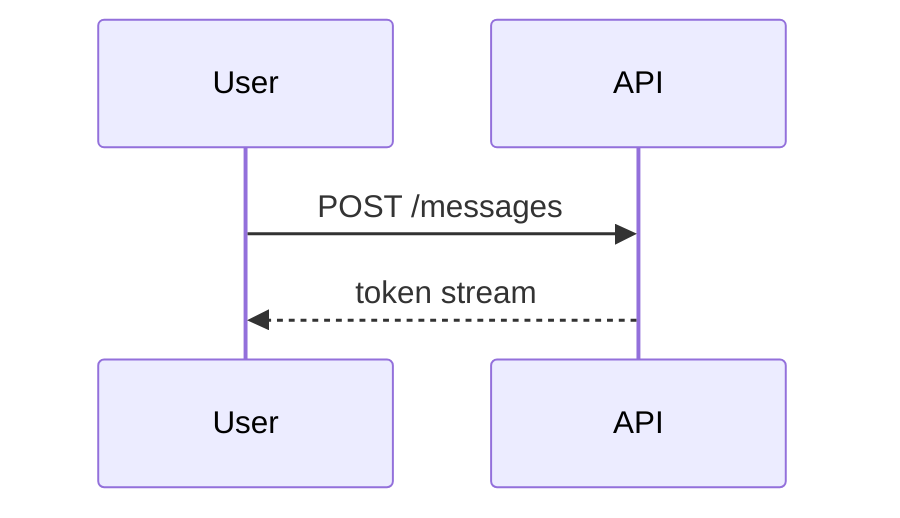

# @inkset/diagram

[Mermaid](https://mermaid.js.org) diagrams rendered as SVG. Lazy-loads the Mermaid bundle on first diagram so pages without diagrams never pay for it.

## Install

```bash
npm install @inkset/diagram mermaid
```

## Usage

```tsx
import { createDiagramPlugin } from "@inkset/diagram";

<Inkset content={markdown} plugins={[createDiagramPlugin()]} />;
```

## What it handles

Code fences with `lang: mermaid`. Everything else is left for `@inkset/code` (or whichever handler comes next).

````md

````

## Options

| Option       | Type      | Default     | What it does                                   |
| ------------ | --------- | ----------- | ---------------------------------------------- |
| `theme`      | `string`  | `"default"` | Mermaid theme: `default`, `dark`, `neutral`.   |
| `showHeader` | `boolean` | `true`      | Show the header strip with copy / source.      |
| `showCopy`   | `boolean` | `true`      | Show copy-to-clipboard for the source.         |
| `showSource` | `boolean` | `false`     | Show a "view source" toggle alongside the SVG. |

## Streaming behavior

While the fence is open, the plugin shows the source text with a muted "rendering…" indicator. Mermaid runs as soon as the closing fence appears; the SVG replaces the placeholder without a layout jump, because the plugin measures the final rendered height ahead of the swap.

## Bundle weight

Mermaid is ~650 KB gzipped — substantial. The plugin only loads it when a diagram actually renders; a page without diagrams pays nothing.
