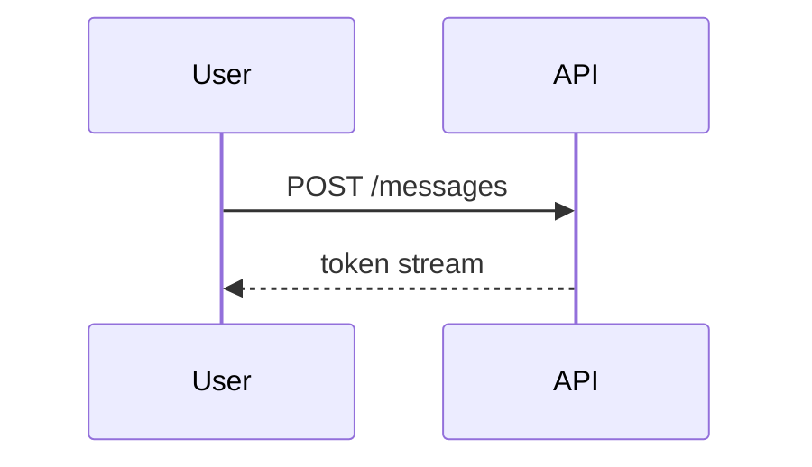
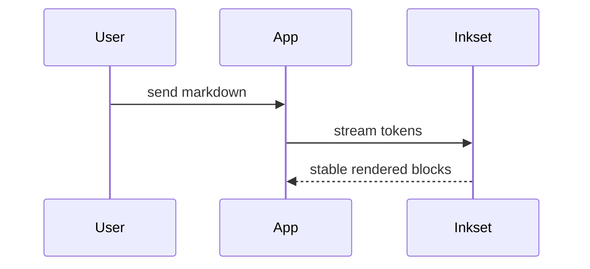

# @inkset/diagram

[Mermaid](https://mermaid.js.org) diagrams rendered as SVG.

## Install

```bash
npm install @inkset/diagram mermaid
```

## Usage

```tsx
import { createDiagramPlugin } from "@inkset/diagram";

<Inkset content={markdown} plugins={[createDiagramPlugin()]} />;
```

## What it handles

Code fences with `lang: mermaid`. Everything else is left for `@inkset/code` (or whichever handler comes next).

````md

````

## Example



## Options

| Option       | Type      | Default     | What it does                                                      |
| ------------ | --------- | ----------- | ----------------------------------------------------------------- |
| `theme`      | `string`  | `"dark"`    | Mermaid theme: `default`, `dark`, `neutral`, `forest`, or `base`. |
| `language`   | `string`  | `"mermaid"` | Language name used for fence detection.                           |
| `showHeader` | `boolean` | `true`      | Show the header strip when the copy button is visible.            |
| `showCopy`   | `boolean` | `true`      | Show copy-to-clipboard for the source.                            |

## Streaming behavior

While the fence is open, the plugin shows the source text. Once the fence closes, Mermaid renders the SVG and the React layer patches the block height after the content settles.

## Bundle weight

Mermaid is still a substantial dependency. Register the diagram plugin when you need Mermaid support, but do not assume it is free just because no diagram happened to render on a particular page.
